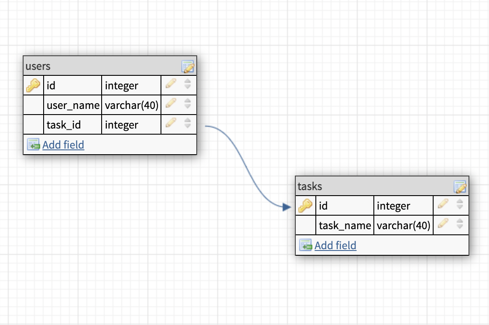

# MatchUP

## About

MatchUP is a social platform focused on paired activities and tasks. It was designed for users seeking to find and match with people who have similar interests and likeminded goals. Sometimes, things can't be done alone, so MatchUP helps users who need or want to find a partner to accomplish a task or do an particular activity, but aren't necessarily looking for a friendship or a longterm commitment.


## _Features_

- Ability to fetch user names from a MYSQL database
- Ability to fetch tasks from a MYSQL database
- Displays database information in 3 different dropdown menus
- Ability to choose two names and a task with the dropdown menus.
- 'MatchUP' submit button disables if two different names are not chosen.
- Ability to display all submitted matches in a table.

## _Technologies_

- Frontend

  - React JS
  - React-Bootstrap
  - CSS
  - React Router for Frontend routes
  - Canva.com for mock-up logo

- Backend
  - MYSQL DB
  - Express JS
  - Node JS

## Setup

### Dependencies

- Backend
  - Run `npm install` in project directory (root folder). This will install server-related dependencies such as `express`.
- Frontend -`cd client` and run `npm install`. This will install client dependencies (React).

### Database Prep

- Access the MySQL interface in your terminal by running `mysql -u root -p`
- Create a new database called matchup: `create database matchup`
- Add a `.env` file to the project folder of this repository containing the MySQL authentication information for MySQL user. For example:

```bash
  DB_HOST=localhost
  DB_USER=root
  DB_NAME=matchup
  DB_PASS=YOURPASSWORD
```

- Run `npm run migrate` in the project folder of this repository, in a new terminal window. This will create a two tables called 'users' and 'tasks' in your database.

## MySQL Database Schema



## API Routes Design


### Development

- Run `npm start` in project directory to start the Express server on port 5002
- In another terminal, do `cd client` and run `npm start` to start the client in development mode with hot reloading in port 3000.

## Possible Future Features

- In the future, this app could feature a login page that keeps track of users in order to create a larger and more dynamic database.
- This app could also feature a page that allows users to create new activities to add to the database.
- Users could have the option to 'delete' or 'edit' matches that have been submitted.
- Matches could also display more privately in the user's profile instead of the main page.

## Notes

_This is a student project that was created at [CodeOp](http://CodeOp.tech), a full stack development bootcamp in Barcelona._
